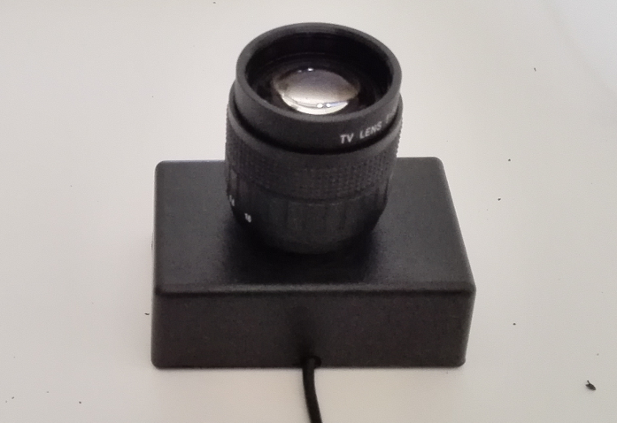
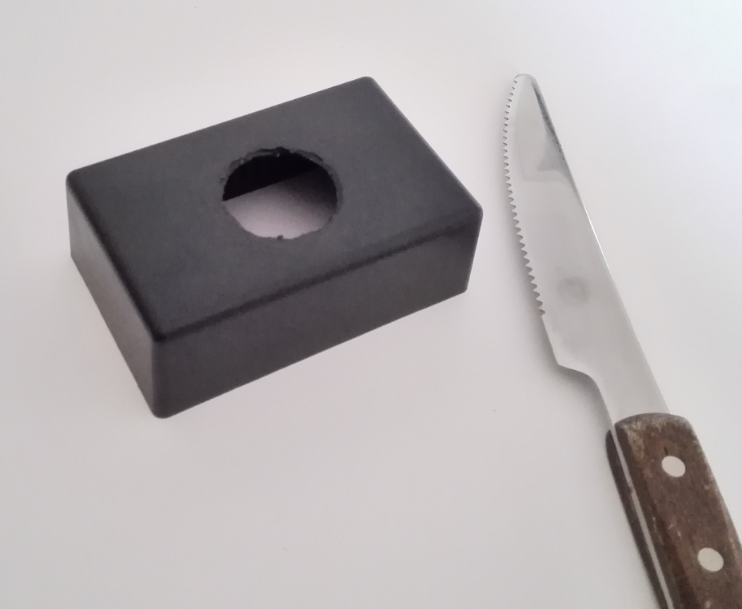
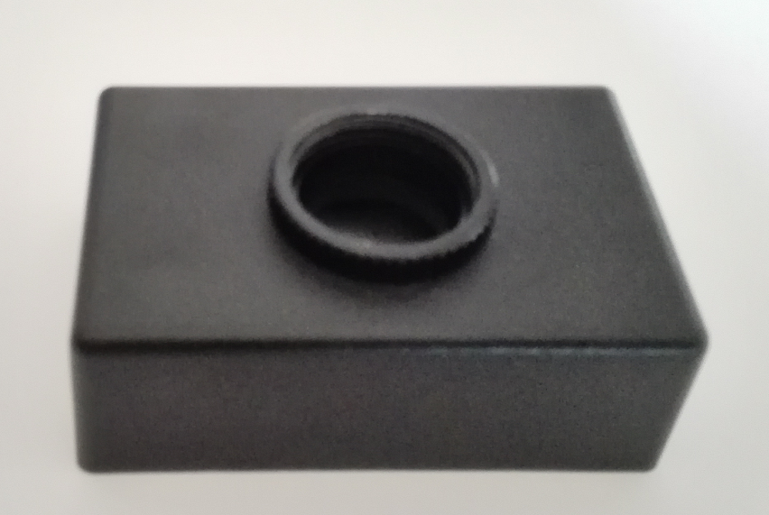
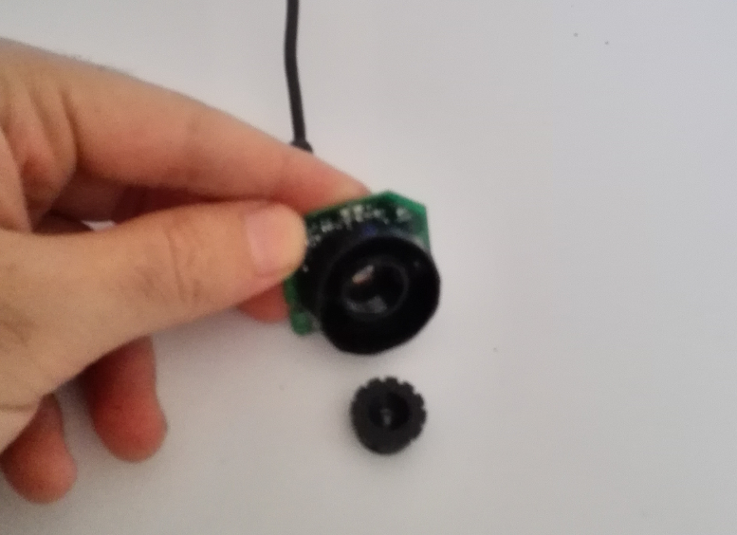
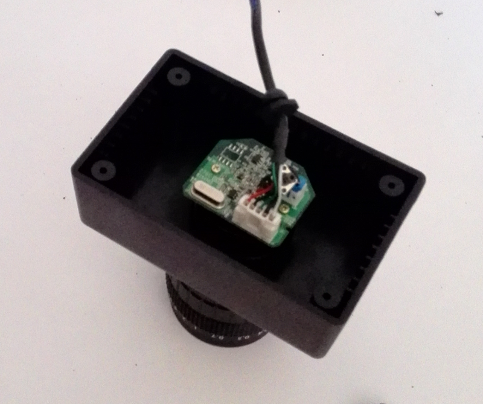
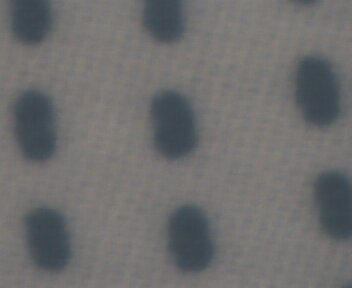
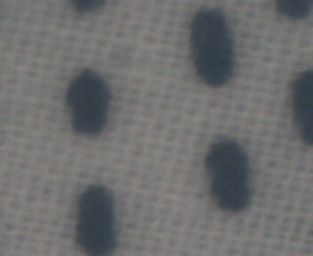

When soldering small devices and when inspecting circuits I sometimes need some help because I'm not able to see as much as I would like to. I've built a simple and cheap microscope with CCTV lenses and a webcam in  order to make these tasks easier.

I've reused an old Logitech QuickCam Express and bought an ABS plastic case and a [50mm CCTV lenses](http://www.dx.com/p/50mm-f1-4-c-mount-cctv-lens-set-w-macro-rings-for-milc-black-144836#.VD6bN-LwyCi) in which I spent around 26€.

After taking apart all the pieces of the webcam I disposed everything except the image sensor. Lens rear cap was perfect as holder for the image sensor.

In my package there was two macro rings that I used to hold the lens to the plastic cage. Some glue helped to hold the rear cap to one of the rings.

You can see the result in the following images. The first one was made 50cm from the surface and it was difficult to focus. Resolution is not high at all but enough. I was trying to focus on a piece of fabric.

For being able to focus in shorter distances I had to pull 3mm back the image sensor. The result was a much easier to focus image at a 30cm distance which is a surprisingly good result compared to what I really expected. Here it is the image:

