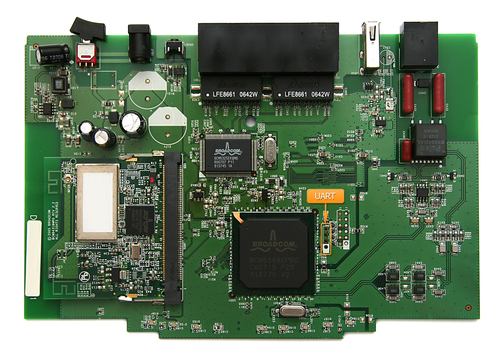

We're used to interact with devices through a screen and a keyboard. They are very practical and easy to use interfaces but sometimes can be too expensive for some devices to include them.

Embedded devices like routers simply don't need a graphical interface and we sometimes forget that Ethernet or WiFi are not the only access vectors that can be used to pentest this kind of devices.

Almost every embedded device includes an UART port that gives access to a lot of useful information when looking for vulnerabilities. This type of ports are commonly hidden by the device case, but once opened, they're usually easy to locate and provide lots of debug information and even consoles to interact.

## How to interface an UART port:

An UART port consists on 4 wires. A 0 volt reference (GND), a transmission wire (TX) and a reception one (RX). A nominal voltage reference should be also there but it is not always present.

In order to interact with the devices we need some extra hardware. An example can be the [Bus Pirate](http://dangerousprototypes.com/bus-pirate-manual/) which is able to interface a lot of protocols but any other UART to serial USB adapter can be used. TX (Transmitting pin) of the device we are interfacing should be connected to RX (Receiving pin) in our bus pirate. And RX (Receiving pin) in device should be connected to TX (Transmission pin) in the adapter. Ground pin (GND) should be connected to ground pin. That's enough for transmitting and receiving data.

Another option would be using an Arduino. If you hold an Arduino in reset mode the GPIO ports will be in tri-state mode (this is the equivalent of removing the processor from the circuit). In order to hold the processor in the reset mode just connect the reset pin with GND (active at low state). Now if you connect a serial device to pins 0 and 1 in the Arduino UNO the communications will be forwarded to your computer.

## How to locate the ports:

Locating an UART port starts with a visual inspection. Three or four pin headers and test points around the main chips are possible candidates. For the examples I will be using an old ZyXEL P660HW-D1. This router board is easy as it only contains two candidates and they have the header already soldered as can be seen in the image.

Testing the GND pin is the easiest one. Metal cases are almost always grounded and we can use them to detect the ground pin. With a polymeter in "beep" mode, the device turned off and unplugged, put one of the probes in a metal case and with the other test the pins for an immediate beep.

Once the GND pin is located it is not very difficult to locate the VCC pin in the "beep" mode. By putting one of the probes in the GND pin test the remaining pins for a very short beep. As voltage supplies don't always provide stable voltages, capacitors are used to stabilize noise so when the polymeter tests between VCC and GND it sees an almost short circuit while the capacitors get charged and when they get charged no current goes through them so resistance raises stopping the beep. In addition, if we power up the device we can test for a stable voltage taking GND as a reference. They usually operate at a 3.3V level although 5V or 12V were common in older devices. In other devices VCC may not be available but we don't really need it.

The next step is to locate the device transmission pin. It is recommended to use the polymeter to measure the voltage of the candidate points while powering up the device. The TX pin should have a voltage between GND and VCC that will oscillate until the device has finished booting up, after that, the voltage will stabilize to either 0 volts or VCC. This is because after the device has fully booted it will stop sending messages and the voltage will remain constant. The pins can be finally checked with the UART interface (Bus pirate/Arduino...) by connecting the GND and TX signals and trying to guess the UART port configuration as explained in the next section.

Finally RX it is usually very near to the TX pin and it is found by trying to transmit anything to the device after the configuration has been guessed.

All this process can be simplified by an oscilloscope that can be used to search for square waves in the candidate pins.
