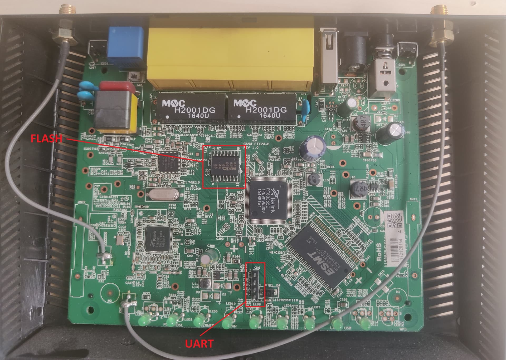

Previously, in [ASUS DSL-N14U flash reading fail...](http://antoniovazquezblanco.github.io/2022/11/22/ASUS-DSL-N14U-flash-reading-fail.html), I tried to dump the router firmware by directly reading the flash memory from the router using flashrom and a Bus Pirate. As it didn't work as expected, I've went and kept tinkering with it...

Looking at the router internals an unpopulated header caught my attention. I've soldered some headers to the CN6 marked connector and tested [whether this was an UART or not](http://antoniovazquezblanco.github.io/2015/05/10/UART-and-Serial-ports.html).



After properly connecting an UART to USB adapter and rebooting the device it was time to guess the configuration. I defaulted to the no parity and one stop bit configuration as it is uncommon to find any device that is not configured in this way. For the speed configuration, most common standard speeds were evaluated and found that the device was outputting at 115200 bauds.

First things first, I captured a full bootlog. It may come in handy in the future and may leak some information such as addresses, hardware info...

<details>
<summary>Full bootlog</summary>

```plaintext
RT63365 at Mon Feb 13 20:40:38 CST 2012

Memory size 64MB

flash base: b0000000
Found SPI Flash 16MiB MX25L12805D at 0xb0000000
Bootloader version: 3.1

Search PHY addr and found PHY addr=1
Press reset button to boot command mode.
Press any key in 1 secs to enter boot command mode.
.

checkimage...ok
Decompress to 80020000 free_mem_ptr=80600000 free_mem_ptr_end=80780000
Uncompressing [LZMA] ...  done.
Linux version 2.6.22.15 (root@localhost) (gcc version 4.3.4 (GCC) ) #1 SMP Sat Nov 30 02:26:27 CST 2019
ISPRAM0: PA=002a8000,Size=00008000,enabled
Enable SRAM=1c000001
Ralink RT63365 SOC prom init
CPU revision is: 00019555
Determined physical RAM map:
 memory: 04000000 @ 00000000 (usable)
3 available secondary CPU TC(s)
Built 1 zonelists.  Total pages: 16256
Kernel command line: console=ttyS0 rootfstype=squashfs es=1
Primary instruction cache 64kB, physically tagged, 4-way, linesize 32 bytes.
Primary data cache 32kB, 4-way, linesize 32 bytes.
Synthesized TLB refill handler (23 instructions).
Synthesized TLB load handler fastpath (37 instructions).
Synthesized TLB store handler fastpath (37 instructions).
Synthesized TLB modify handler fastpath (36 instructions).
Cache parity protection disabled
PID hash table entries: 256 (order: 8, 1024 bytes)
CPU frequency 498.00 MHz
Using 250.000 MHz high precision timer.
console handover: boot [early0] -> real [ttyS0]
Dentry cache hash table entries: 8192 (order: 3, 32768 bytes)
Inode-cache hash table entries: 4096 (order: 2, 16384 bytes)
Memory: 61184k/65536k available (2626k kernel code, 4296k reserved, 513k data, 160k init, 0k highmem)
SLUB: Genslabs=17, HWalign=32, Order=0-1, MinObjects=4, CPUs=4, Nodes=1
Mount-cache hash table entries: 512
34K sync es set to 1.
Config7: 0x80080500
FPU Affinity set after 1105 emulations
Limit of 4 TCs set
TLB of 64 entry pairs shared by 2 VPEs
VPE 0: TC 0 1 2, VPE 1: TC 3
IPI buffer pool of 32 buffers
CPU revision is: 00019555
TC 1 going on-line as CPU 1
CPU revision is: 00019555
TC 2 going on-line as CPU 2
CPU revision is: 00019555
TC 3 going on-line as CPU 3
Brought up 4 CPUs
migration_cost=10000
NET: Registered protocol family 16
RT63365_pcie_init
registering PCI controller with io_map_base unset
PCI: Bridge: 0000:00:00.0
  IO window: disabled.
  MEM window: 20000000-200fffff
  PREFETCH window: disabled.
NET: Registered protocol family 8
NET: Registered protocol family 20
Time: MIPS clocksource has been installed.
NET: Registered protocol family 2
IP route cache hash table entries: 1024 (order: 0, 4096 bytes)
TCP established hash table entries: 2048 (order: 2, 24576 bytes)
TCP bind hash table entries: 2048 (order: 2, 16384 bytes)
TCP: Hash tables configured (established 2048 bind 2048)
TCP reno registered
TC3162 hardware watchdog module loaded.
squashfs: version 3.0 (2006/03/15) Phillip Lougher
io scheduler noop registered (default)
ttyS0 at I/O 0xbfbf0003 (irq = 1) is a TC3162
RAMDISK driver initialized: 16 RAM disks of 4096K size 1024 blocksize
PPP generic driver version 2.4.2
PPP Deflate Compression module registered
PPP BSD Compression module registered
PPP MPPE Compression module registered
NET: Registered protocol family 24
PPPoL2TP kernel driver, V1.0
PPTP driver version 0.8.5
IMQ starting with 2 devices...
IMQ driver loaded successfully.
.Hooking IMQ after NAT on PREROUTING.
.Hooking IMQ before NAT on POSTROUTING.
tc3162: flash device 0x01000000 at 0x10000000
tc3162: Found SPIFLASH 16MiB MX25L12805D
Creating 6 MTD partitions on "tc3162":
0x00000000-0x00010000 : "bootloader"
0x00010000-0x00020000 : "romfile"
0x00020000-0x0012e915 : "kernel"
mtd: partition "kernel" doesn't end on an erase block -- force read-only
0x0012e915-0x00f52915 : "rootfs"
mtd: partition "rootfs" doesn't start on an erase block boundary -- force read-only
0x00020000-0x00fc0000 : "tclinux"
0x00fc0000-0x01000000 : "reservearea"
RT3xxx EHCI/OHCI init.
u32 classifier
    input device check on 
    Actions configured 
Netfilter messages via NETLINK v0.30.
nf_conntrack version 0.5.0 (512 buckets, 4096 max)
ctnetlink v0.93: registering with nfnetlink.
xt_time: kernel timezone is -0000
GRE over IPv4 demultiplexor driver<6>GRE over IPv4 tunneling driver
ip_tables: (C) 2000-2006 Netfilter Core Team
TCP cubic registered
NET: Registered protocol family 1
NET: Registered protocol family 10
IPv6 over IPv4 tunneling driver
NET: Registered protocol family 17

 Mac = 60:45:cb:8e:a:fc<6>802.1Q VLAN Support v1.8 Ben Greear <greearb@candelatech.com>
All bugs added by David S. Miller <davem@redhat.com>
VFS: Mounted root (squashfs filesystem) readonly.
Freeing unused kernel memory: 160k freed
busybox init and set aff
init started:  BusyBox v1.00 (2019.11.29-18:28+0000) multi-call binary.
Sat Jan  1 00:00:00 UTC 2011
chmod: /userfs/profile.cfg: Read-only file system
tcfullcone version: tcfullcone V1.1.0.0 (Feb 13 2012-20:16:35).
module_sel: module license 'unspecified' taints kernel.
tcportbind version: tcportbind V1.1.0.0 (Feb 13 2012-20:16:38).
vlantag_drv_init
TCSUPPORT_IPV6
TC3162 LED Manager 0.1 init
tcledctrl version: tcledctrl V1.1.0.0 (Nov 30 2019-02:26:48).
tccicmd V1.1.0.0 (Nov 30 2019-02:26:50)
the number of cfg node is 81
register a node 0
register a node 1
register a node 2
register a node 3
register logAccess_init ter a node 5LanguageSwitch_init 
regivendorCfgFile_init ster a node 8
registarpstorm_init
gisteThe number of cache node is 5

register a node 12
register a node 13
register a node 14
register a node 15
register a node 16
register a node 17
register a node 18
register a node 19
register a node 20
register a node 21
register a node 22
register a node 23
register a node 24
register a node 25
register a node 26
register a node 27
register a node 28
register a node 29
register a node 30
register a node 31
register a node 32
register a node 33
register a node 34
register a node 35
register a node 36
register a node 37
register a node 38
register a node 39
register a node 40
register a node 41
register a node 42
register a node 43
register a node 44
register a node 45
register a node 46
register a node 47
register a node 48
register a node 49
register a node 50
register a node 51
register a node 52
register a node 53
register a node 54
register a node 55
register a node 56
register a node 57
register a node 58
register a node 59
register a node 60
register a node 61
register a node 62
register a node 63
register a node 64
register a node 65
register a node 66
register a node 67
register a node 68
register a node 69
register a node 70
register a node 71
register a node 72
register a node 73
register a node 74
register a node 75
register a node 76
register a node 77
register a node 78
register a node 79
[do_parse_romfile, 27]Start
[tc_parse_romfile, 245]Start
[tc_parse_romfile, 257]opername(/dev/mtdblock1)
[tc_parse_romfile, 260]check rom file(/dev/mtdblock1)
[check_romfile, 108]pathname(/dev/mtdblock1)
[check_romfile, 117]load XML file.
mxml: Bad control character 0x1f not allowed by XML standard!
[check_romfile, 174]2nd load XML file.
[check_romfile, 204]verify rom file.
[check_romfile, 217]return tree
Check romfile pass![tc_parse_romfile, 382]rechecknum(0)
[tc_parse_romfile, 389]laod backup romfile
[loadRomfile, 77](1)
[loadRomfile, 114]BK_ROMFILE_FLAG
mtd[readflash]:device=reservearea tclen=65536 tcoffset=0
Unlocking reservearea ...
Reading from reservearea to /tmp/tc_backupromfile ... 
[BK_ROMFILE_FLAG]/userfs/bin/mtd readflash /tmp/tc_backupromfile 65536 0 reservearea
[tc_parse_romfile, 396]check backup romfile
[check_romfile, 108]pathname(/tmp/tc_backupromfile)
[check_romfile, 117]load XML file.
mxml: Bad control character 0x1f not allowed by XML standard!
[check_romfile, 174]2nd load XML file.
[check_romfile, 204]verify rom file.
[check_romfile, 217]return tree
[tc_parse_romfile, 416]backup romfile is already exist.
Dualwan set wan_primary=0
Dualwan set wan_secondary=-1
killall: wpa_supplicant: no process killed
 goto wlan_write!!killall: wpa_supplicwlnoan_write---goto fopen!!WPSActiveStatus = NULL
WPSOOBActive = NULL
ReCounterActive = NULL
WPSGenPinCode = NULL
write_wlan_AutoChannelSkipList -(0x20)
[route_setting]remove interface[0]=[ppp0]
generate miniupnpd.conf
_gen_upnp_conf

==>syslog_write error, get WriteFlashInterval value failed

==>syslog_write error, get UpdateInterval value failed

==>syslog_write error, get AllLogSave value failed
insmod raeth driver
femac.c:v1.00-NAPI 29.Mar.2011
eth0: FE MAC Ethernet address: 60:45:CB:8E:0A:FC
hotplug net INTERFACE=eth0 ACTION=add
TSARM: TC3162 ATM SAR driver 1.5 init
tc3162sar V1.2.0.0 (Nov 30 2019-02:26:46)
register autopvc cmd to sys
TSARM: TC3162 ATM SAR driver 1.5 done
ifconfig: ra0: error fetching interface information: Device not found

ra0       no private ioctls.
ra0       No such device

[main, 767]Init for web interface cfg node

lanHost_read: Create node LanHost !
ADSL DMT initialization starting
Begin AdslTaskInit.....
End AdslTaskInit
Begin to  request IRQ 20
DMT:Succeed to request IRQ 20
Initializing ADSL F/W 3.20.56.24 ......
Reset dmtCheck DMT version =b2 ........ Initializing ADSL F/W ........ done ADSL HW version: b2, HCLK 166Cannot find device "br0"
killall: tcapi: no process killed
cfg_manager start to init server socket
killall: ntpclient: no process killed
setup_receive:: bind...
pool.ntp.org: Unknown host
TCSUPPORT_WLAN
TCSUPPORT_WLAN_RT5392
The remaining IMEM space cannot accommodate section .text.imem !!Remaining IMEM space: -2544 bytes.Section Size: 764 bytesPCI: Enabling device 0000:01:00.0 (0000 -> 0002)

=== pAd = c00f1000, size = 506720 ===

<-- RTMPAllocTxRxRingMemory, Status=0
<-- RTMPAllocAdapterBlock, Status=0
Efuse Size=0x2d [2d0-2fc] 
hotplug net INTERFACE=ra0 ACTION=add
Mirror/redirect action on
insmod: cannot open module `/lib/modules/2.6.22.15/kernel/net/sched/cls_fw.ko': No such file or directory
insmod: cannot open module `/lib/modules/2.6.22.15/kernel/net/sched/sch_htb.ko': No such file or directory
insmod: cannot open module `/lib/modules/2.6.22.15/kernel/net/sched/sch_prio.ko': No such file or directory
Ebtables v2.0 registered
igmpsnoop V1.1.0.0 (Feb 13 2012-20:16:36)
mldsnooping V1.1.0.0 (Feb 13 2012-20:16:36)
eth0: starting interface.
alloc_sram p=bc000800 free=7800
alloc_sram p=bc002800 free=5800
TC2105MJ, <6>Ralink HW NAT Module Enabled
hotplug net INTERFACE=br0 ACTION=add
device eth0 entered promiscuous mode
hotplug net INTERFACE=br1 ACTION=add
TCSUPPORT_WLAN: ifconfig
TCSUPPORT_WLAN_PERSSID_SWITCH disabled!
(2)Going to bring up WiFi interfaces!!
TCSUPPORT_WLAN_WDS
SSH
TC3162 hardware watchdog initialized
Ethernet Media-Type Support
monitorcfgmgr
Copyright (C) 2013 ASUS Corp. Renjie_Lee@asus.com

Jan  1 00:00:12 monitorcfgmgr[558]: [start monitorcfgmgr]
four ports
SIOCGIFFLAGS: No such device
interface elan.1 does not exist!
ERROR: trying to remove VLAN -:elan.1:- error: Invalid argument
SIOCGIFFLAGS: No such device
interface elan.2 does not exist!
ERROR: trying to remove VLAN -:elan.2:- error: Invalid argument
SIOCGIFFLAGS: No such device
interface elan.3 does not exist!
ERROR: trying to remove VLAN -:elan.3:- error: Invalid argument
SIOCGIFFLAGS: No such device
interface elan.4 does not exist!
ERROR: trying to remove VLAN -:elan.4:- error: Invalid argument
SIOCGIFFLAGS: No such device
interface elan.5 does not exist!
ERROR: trying to remove VLAN -:elan.5:- error: Invalid argument
SIOCGIFFLAGS: No such device
interface elan.6 does not exist!
ERROR: trying to remove VLAN -:elan.6:- error: Invalid argument
device eth0 is already a member of a bridge; can't enslave it to bridge br0.
Added VLAN with VID == 1 to IF -:eth0:-
WARNING:  VLAN 1 does not work with many switches,
consider another number if you have problems.
hotplug net INTERFACE=eth0.1 ACTION=add
elan.1: add 33:33:00:00:00:01 mcast address to master interface
elan.1: add 01:00:5e:00:0g0:01  mcast address to master interface
Added VLAN with VID == 2 to IF -:eth0:-
hotplug net INTERFACE=eth0.2 ACTION=add
elan.2: add 33:33:00:00:00:01 mcast address to master interface
elan.2: add 01:00:5e:00:00:01 mcastT address to masCter interface
Added VLAN with VID == 3 to IF -:eth0:-
hotplug net INTERFACE=eth0.3 ACTION=add
elan.3: add 33:33:00:00:00:01 mcast address to master interface
elan.3: add 01:h00:5pe:00:00:01 mcasCt address to ma=ster interface
Added VLAN with VID == 4 to IF -:eth0:-
hotplug net INTERFACE=eth0.4 ACTION=add
elan.4: add 33:33:00:00:00:01 mcast address to master interface
elan.4: add 01:00:5e:0o0:00:01 mcast aEddress to masteTr interface
device eth0 left promiscuous mode
br0: port 1(eth0) entering disabled state
* phyaddr=0 Reg=00 value=8000* phyaddr=1 Reg=00 value=8000* phyaddr=2 Reg=00 value=8000* phyaddr=3 Reg=00 value=8000block hotplug INTERFACE=(null) ACTION=add USBPORT=(null) HOST=(null) DEVICE=(null)
block hotplug INTERFACE=(null) ACTION=add USBPORT=(null) HOST=(null) DEVICE=(null)
block hotplug INTERFACE=(null) ACTION=add USBPORT=(null) HOST=(null) DEVICE=(null)
block hotplug INTERFACE=(null) ACTION=add USBPORT=(null) HOST=(null) DEVICE=(null)
block hotplug INTERFACE=(null) ACTION=add USBPORT=(null) HOST=(null) DEVICE=(null)
block hotplug INTERFACE=(null) ACTION=add USBPORT=(null) HOST=(null) DEVICE=(null)
block hotplug INTERFACE=(null) ACTION=add USBPORT=(null) HOST=(null) DEVICE=(null)
block hotplug INTERFACE=(null) ACTISRAONadd USBPORT=(null) HOST=(null) DEVICE=(null)
US bitswap on,DS bitswap onblock hotplug INTERFACE=(null) ACTION=add USBPORT=(null) HOST=(null) DEVICE=(null)
block hotplug IOlrONF=(null) ACTION=add USBPORT=(null) HOST=(null) DEVICE=(null)
block hotplug INTERFACE=(null) ACTISet SNRM OFFSET = 5.0 dbl) HOST=(null) DEVICE=(null)
offset = -2560/512 / -2560/512 blSet Agc Vref1 = 352 ; Vref2 F= 352 ; Vref3 =n 352) ACTION=add USBPORT=(null) HOST=(null) DEVICE=(null)
AGCb Vrekf1 = 352 ; Vref2 = 352 ; Vref3 = 352 ; VreOf4 = 352OST=(null) DEVICE=(null)
Please reset DSL to use default setting!!!block hotplug INTERFACE=(null) ACTION=add USBPORT=(null) HOST=(null) DEVICE=(null)
block hotplug INTERFACE=(null) ACTION=add USBPORT=(null) HOST=(null) DEVICE=(null)
block hotplug INTERFACE=(null) ACTION=add USBPORT=(null) HOST=(null) DEVICE=(null)
block hotplug INTERFACE=(null) ACTION=add USBPORT=(null) HOST=(null) DEVICE=(null)
block hotplug INTERFACE=(null) ACTION=add USBPORT=(null) HOST=(null) DEVICE=(null)
block hotplug INTERFACE=(null) ACTION=add USBPORT=(null) HOST=(null) DEVICE=(null)
block hotplug INTERFACE=(null) ACTION=add USBPORT=(null) HOST=(null) DEVICE=(null)
block hotplug INTERFACE=(null) ACTION=add USBPORT=(null) HOST=(null) DEVICE=(null)
block hotplug INTERFACE=(null) ACTION=add USBPORT=(null) HOST=(null) DEVICE=(null)
hotplug net INTERFACE=br0 ACTION=add
hotplug net INTERFACE=br0 ACTION=add
hotplug net INTERFACE=br1 ACTION=add
hotplug net INTERFACE=br1 ACTION=add
hotplug net INTERFACE=elan.1 ACTION=add
hotplug net INTERFACE=elan.2 ACTION=add
hotplug net INTERFACE=elan.3 ACTION=add
hotplug net INTERFACE=eth0 ACTION=add
hotplug net INTERFACE=gre0 ACTION=add
hotplug net INTERFACE=elan.4 ACTION=add
hotplug net INTERFACE=imq0 ACTION=add
hotplug net INTERFACE=elan.1 ACTION=add
hotplug net INTERFACE=imq1 ACTION=add
hotplug net INTERFACE=ip6tnl0 ACTION=add
hotplug net INTERFACE=elan.2 ACTION=add
hotplug net INTERFACE=ra0 ACTION=add
hotplug net INTERFACE=teql0 ACTION=add
hotplug net INTERFACE=sit0 ACTION=add
hotplug net INTERFACE=lo ACTION=add
hotplug net INTERFACE=elan.3 ACTION=add
hotplug net INTERFACE=elan.4 ACTION=add
hotplug net INTERFACE=gre0 ACTION=add
hotplug net INTERFACE=imq0 ACTION=add
hotplug net INTERFACE=eth0 ACTION=add
hotplug net INTERFACE=imq1 ACTION=add
hotplug net INTERFACE=lo ACTION=add
hotplug net INTERFACE=ra0 ACTION=add
ANNEXAIJLMDLA: start
hotplug net INTERFACE=ip6tnl0 ACTION=add
hotplug net INTERFACE=sit0 ACTION=add
br0: port 5(elan.4) entering learning state
br0: port 4(elan.3) entering learning state
br0: port 3(elan.2) entering learning state
br0: port 2(elan.1) entering learning state
br0: topology change detected, propagating
br0: port 5(elan.4) entering forwarding state
br0: topology change detected, propagating
br0: port 4(elan.3) entering forwarding state
br0: topology change detected, propagating
br0: port 3(elan.2) entering forwarding state
br0: topology change detected, propagating
br0: port 2(elan.1) entering forwarding state
hotplug net INTERFACE=teql0 ACTION=add
[cfgmgr](SIGCHLD:P979)..
[cfgmgr](SIGCHLD:P981)..
[cfgmgr](SIGCHLD:P983)..
[cfgmgr](SIGCHLD:P985)..
device br1 already exists; can't create bridge with the same name
hotplug net INTERFACE=br2 ACTION=add
check_and_set_iptv_ifname: a9fe359c(169.254.53.156)
_ifconfig: name=br2 flags=1043 IFUP addr=169.254.53.156 netmask=255.255.0.0
hotplug net INTERFACE=br3 ACTION=add
check_and_set_iptv_ifname: a9fe8eae(169.254.142.174)
_ifconfig: name=br3 flags=1043 IFUP addr=169.254.142.174 netmask=255.255.0.0
hotplug net INTERFACE=br4 ACTION=add
check_and_set_iptv_ifname: a9fe37ea(169.254.55.234)
_ifconfig: name=br4 flags=1043 IFUP addr=169.254.55.234 netmask=255.255.0.0
update_wan_state(wan0_, 0, 0)
update_wan_state(wan1_, 5, 0)
update_wan_state(wan2_,=====)
===================insmod iptable_filter=======================
date_wan_state(wan5_, 5, 0)
update_wan_state(wan6_, 5, 0)
update_wan_state(wan7_, 5, 0)
update_wan_state(wan8_, 5, 0)
update_wan_state(wan9_, 5, 0)
update_wan_state(wan10_, 5, 0)
update_wan_state(wan11_, 5, 0)
update_wan_state(wan12_, 5, 0)
========================insmod ipt_REJECT=======================
/etc/isp0.conf
SIOCGIFFLAGS: No such device
RFC1483/2684 bridge: Interface "nas0" created sucessfully

RFC1483/2684 bridge: Communicating over ATM 0.8.32, encapsulation: LLC

qos.txtp.traffic_class = 1
hotplug net INTERFACE=nas0 ACTION=add
RFC1483/2684 bridge: Interface configured
RFC1483/2684 bridge: RFC 1483/2684 bridge daemon started

/etc/isp1.conf
Plugin libpppoe.so loaded.
RP-PPPoE plugin version 3.8p compiled against pppd 2.4.7
/etc/isp2.conf
/etc/isp3.conf
/etc/isp4.conf
/etc/isp5.conf
/etc/isp6.conf
/etc/isp7.conf
/etc/isp8.conf
/etc/isp9.conf
/etc/isp10.conf
/etc/isp11.conf
/etc/isp12.conf
Radvd is disabled
dhcp6s is disabled!
info, udhcpd (v0.9.9-pre) started
error, Unable to open /etc/udhcpd.leases for reading
 goto wlan_boot!!!Interface doesn't accept private ioctl...
set (8BE2): Network is down
 goto write_wlan_first_profile()!!write_wlan_AutoChannelSkipList -(0x20)
xyyou : in pcie init function,need not reset
RX DESC a3385000  size = 2048
pAd->ed_chk = 2
RtmpChipOpsEepromHook::e2p_type=0, inf_Type=5
RtmpEepromGetDefault::e2p_dafault=1
efuse_probe::bUseEfuse = 1
NVM is EFUSE mode
1. Phy Mode = 9
2. Phy Mode = 9
NVM is efuse and its size =2d[2d0-2fc]
NVM is efuse and the information is too less to bring up the interface
Load EEPROM buffer from BIN, and force to use BIN buffer mode
RtmpChipOpsEepromHook::e2p_type=4, inf_Type=5
NVM is BIN mode
now bb MainSsid mac 60:45:cb:8e:0a:fc
3. Phy Mode = 9
test--AntCfgInit: primary/secondary ant 0/1
bAutoTxAgcG = 1
MCS Set = ff ff 00 00 01
@@@ GetEDCCASupport: CountReg=[DE], DfsType=0, edcca_on=1, ed_chk=2
@@@ GetEDCCASupport: return TRUE
@@@ ed_monitor_init : ===>
@@@ ed_monitor_init : <===
Main bssid = 60:45:cb:8e:0a:fc
<==== rt28xx_init, Status=0
0x1300 = 00064380
jiffies=ffff9543, POLLING_MODE_DETECT_INTV=300hotplug net INTERFACE=wds0 ACTION=add
device ra0 entered promiscuous mode
br0: port 1(ra0) entering learning state
br0: topology change detected, propagating
br0: port 1(ra0) entering forwarding state
hotplug net INTERFACE=ra1 ACTION=add
hotplug net INTERFACE=ra2 ACTION=add
hotplug net INTERFACE=wds1 ACTION=add
hotplug net INTERFACE=wds2 ACTION=add
hotplug net INTERFACE=ra3 ACTION=add
hotplug net INTERFACE=wds3 ACTION=add

rai0      no private ioctls.
rai0      no private ioctls.
rai0      no private ioctls.

BusyBox v1.00 (2019.11.29-18Di8sable Virtual Slerver / Port Forwardinge function.
elete}]

[cfgmgr](SIGCHLD:P1493)..
nf_conntrack_rtsp v0.6.21 loading
nf_nat_rtsp v0.6.21 loading
generate miniupnpd.conf
_gen_upnp_conf
launch upnp
start_miniupnpd. force(1)
stop upnp first
/userfs/bin/miniupnpd -P /var/log/upnpd.pid -f /var/tmp/miniupnpd.conf &
Disable Virtual Server / Port Forwarding function.
[cfgmgr](SIGCHLD:P1558)..
generate miniupnpd.conf
_gen_upnp_conf
launch upnp
start_miniupnpd. force(1)
stop upnp first
killall_tk: waiting name=miniupnpd n=9
killall_tk: waiting name=miniupnpd n=8
networkmap is gn. launch it.
killall_tk: waiting name=miniupnpd n=7
killall_tk: waiting name=miniupnpd n=6
killall_tk: waiting name=miniupnpd n=5
killall_tk: waiting name=miniupnpd n=4
killall_tk: waiting name=miniupnpd n=3
killall_tk: waiting name=miniupnpd n=2
killall_tk: waiting name=miniupnpd n=1
killall_tk: waiting name=miniupnpd n=0
killall_tk: SIGKILL name=miniupnpd n=9
killall_tk: SIGKILL name=miniupnpd n=8
killall_tk: SIGKILL name=miniupnpd n=7
killall_tk: SIGKILL name=miniupnpd n=6
killall_tk: SIGKILL name=miniupnpd n=5
killall_tk: SIGKILL name=miniupnpd n=4
killall_tk: SIGKILL name=miniupnpd n=3
killall_tk: SIGKILL name=miniupnpd n=2
killall_tk: SIGKILL name=miniupnpd n=1
nas0: no IPv6 routers present
killall_tk: SIGKILL name=miniupnpd n=0
route: SIOC[ADD|DEL]RT/userfs/bin/miniupnpd -P /var/log/upnpd.pid -f /var/tmp/miniupnpd.conf &
Disable Virtual Server / Port Forwarding function.
[cfgmgr](SIGCHLD:P1625)..
generate miniupnpd.conf
_gen_upnp_conf
launch upnp
start_miniupnpd. force(1)
stop upnp first
killall_tk: waiting name=miniupnpd n=9
killall_tk: waiting name=miniupnpd n=8
killall_tk: waiting name=miniupnpd n=7
killall_tk: waiting name=miniupnpd n=6
killall_tk: waiting name=miniupnpd n=5
killall_tk: waiting name=miniupnpd n=4
killall_tk: waiting name=miniupnpd n=3
killall_tk: waiting name=miniupnpd n=2
killall_tk: waiting name=miniupnpd n=1
killall_tk: waiting name=miniupnpd n=0
killall_tk: SIGKILL name=miniupnpd n=9
killall_tk: SIGKILL name=miniupnpd n=8
killall_tk: SIGKILL name=miniupnpd n=7
killall_tk: SIGKILL name=miniupnpd n=6
killall_tk: SIGKILL name=miniupnpd n=5
killall_tk: SIGKILL name=miniupnpd n=4
killall_tk: SIGKILL name=miniupnpd n=3
killall_tk: SIGKILL name=miniupnpd n=2
killall_tk: SIGKILL name=miniupnpd n=1
killall_tk: SIGKILL name=miniupnpd n=0
route: SIOC[ADD|DEL]RT/userfs/bin/sminiupnpd -P /var/log/upnpd.pid -f /var/tmp/miniupnpd.conf &
upnpd_boot
_gen_upnp_conf
start_miniupnpd. force(1)
stop upnp first
killall_tk: waiting name=miniupnpd n=9
killall_tk: waiting name=miniupnpd n=8
killall_tk: waiting name=miniupnpd n=7
killall_tk: waiting name=miniupnpd n=6
killall_tk: waiting name=miniupnpd n=5
killall_tk: waiting name=miniupnpd n=4
killall_tk: waiting name=miniupnpd n=3
killall_tk: waiting name=miniupnpd n=2
killall_tk: waiting name=miniupnpd n=1
killall_tk: waiting name=miniupnpd n=0
killall_tk: SIGKILL name=miniupnpd n=9
killall_tk: SIGKILL name=miniupnpd n=8
killall_tk: SIGKILL name=miniupnpd n=7
killall_tk: SIGKILL name=miniupnpd n=6
killall_tk: SIGKILL name=miniupnpd n=5
killall_tk: SIGKILL name=miniupnpd n=4
killall_tk: SIGKILL name=miniupnpd n=3
killall_tk: SIGKILL name=miniupnpd n=2
killall_tk: SIGKILL name=miniupnpd n=1
killall_tk: SIGKILL name=miniupnpd n=0
route: SIOC[ADD|DEL]RT/userfs/bin/miniupnpd -P /var/log/upnpd.pid -f /var/tmp/miniupnpd.conf &
[write_cur_romfile_in_flash, 456]write running romfile.
Unlocking romfile ...
Writing from /tmp/var/romfile.cfg.gz to romfile ... 
 [ ]...[e]...[w]...[w]...[w]...[w]....
[write_cur_romfile_in_flash, 464]write backup romfile in flash.
[write_backup_romfile]/userfs/bin/mtd writeflash /tmp/var/romfile.cfg.gz 65536 0 reservearea
mtd[writeflash]:device=reservearea tclen=65536 tcoffset=0 tcfilelen =65536
Unlocking reservearea ...
Writing from /tmp/var/romfile.cfg.gz to reservearea ... 
enter real action -----tclen:0x10000,tcoffset:0x0
writeflash: write 0 'st sector,start from 0x0,0x10000 bytes
...[e]...[w]....writeflash: total write 0x10000 bytes

TCAPI save ok.killall: klogd: no process killed
ftp switch turn onsip switch turn onh323 switch turn onrtsp switch turn onl2tp 
 switch turn onipsec switch turn oniptables: No chain/target/match by that name.
ifconfig: ppp0: error fetching interface information: Device not found

[cfgmg #### wan_p5rimary: []
Ralink HW NAT Module Disabled
killall: utelnetd: no process killed
rmmod: hw_nat: No such file or directory
get_iptv_ifname: nas0
check_and_set_iptv_ifname: a9fed8bd(169.254.216.189)
_ifconfig: name=nas0 flags=1043 IFUP addr=169.254.216.189 netmask=255.255.0.0
rmmod: hw_nat: No such wol_boot
rectory
client_list_boot. launch networkmap
arpstorm_boot
Arpstorm_Entry_runin=0
cmd[0]=restart_pppoe_relay
cmd[1]=0
[1779 service:handle_notifications +41] running: 3 pppoe_relay
largeD flag=2 (0:maxD=64, 1:maxD=128, 2:maxD=511)Can't find Node(Info_dot1q), create it.

Done.
Can't find Node(USB), create it.
Can't find Node(USB_Entry), create it.
[write_cur_romfile_in_flash, 456]write running romfile.
Unlocking romfile ...
Writing from /tmp/var/romfile.cfg.gz to romfile ... 
 [ ]...[e]...[w]...[w]...[w]...[w]....
[write_cur_romfile_in_flash, 464]write backup romfile in flash.
[write_backup_romfile]/userfs/bin/mtd writeflash /tmp/var/romfile.cfg.gz 65536 0 reservearea
mtd[writeflash]:device=reservearea tclen=65536 tcoffset=0 tcfilelen =65536
Unlocking reservearea ...
Writing from /tmp/var/romfile.cfg.gz to reservearea ... 
enter real action -----tclen:0x10000,tcoffset:0x0
writeflash: write 0 'st sector,start from 0x0,0x10000 bytes
...[e]...[w]....writeflash: total write 0x10000 bytes

TCAPI save ok.mtd[readflash]:device=reservearea tclen=65536 tcoffset=131072
Unlocking reservearea ...
Reading from reservearea to /var/log/tmp_file ... 
[route_setting]remove interface[0]=[ppp0]
Can't find Node(GUITemp), create it.
Can't find Node(GUITemp_Entry1), create it.

# Enable direct rule
stop_nat_rules: apply the redirect_rules!
start_usb
Firmware version=[1.1.2.3]

Please press Enter to activate this console. usbcore: registered new interface driver usbfs
usbcore: registered new interface driver hub
usbcore: registered new device driver usb
SCSI subsystem initialized
Initializing USB Mass Storage driver...
usbcore: registered new interface driver usb-storage
USB Mass Storage support registered.
ufsd: driver (lke_8.9.0 lke_8.9.0_r217400_b3, LBD=ON, acl, ioctl, sd, wb) loaded at c03da000
NTFS support included
Big endian platform
optimized: speed
Build_for__ASUS_PRODUCTS_005_k2.6.22.15_2013-11-20_lke_8.9.0_r217400_b3

rt3xxx-ehci rt3xxx-ehci: Ralink EHCI Host Controller
rt3xxx-ehci rt3xxx-ehci: new USB bus registered, assigned bus number 1
rt3xxx-ehci rt3xxx-ehci: irq 18, io mem 0x1fbb0000
rt3xxx-ehci rt3xxx-ehci: USB 0.0 started, EHCI 1.00, driver 10 Dec 2004
usb usb1: configuration #1 chosen from 1 choice
hub 1-0:1.0: USB hub found
hub 1-0:1.0: 2 ports detected
Can't find Node(Vram), create it.
Can't find Node(Vram_Entry), create it.
ohci_hcd: 2006 August 04 USB 1.1 'Open' Host Controller (OHCI) Driver
rt3xxx-ohci rt3xxx-ohci: RT3xxx OHCI Controller
rt3xxx-ohci rt3xxx-ohci: new USB bus registered, assigned bus number 2
rt3xxx-ohci rt3xxx-ohci: irq 18, io mem 0x1fba0000
usb usb2: configuration #1 chosen from 1 choice
hub 2-0:1.0: USB hub found
hub 2-0:1.0: 2 ports detected
usbcore: registered new interface driver usblp
drivers/usb/class/usblp.c: v0.13: USB Printer Device Class driver
[write_cur_romfile_in_flash, 456]write running romfile.
usbcore: registered new interface driver asix
[write_cur_romfile_in_flash, 464]write backup romfile in flash.
TCAPI save ok.Can't find Node(LogAccess_ToFile), create it.
usbcore: registered new interface driver cdc_ether
usbcore: registered new interface driver rndis_host
cdc_ncm: 14-Mar-2012
usbcore: registered new interface driver cdc_ncm
usbcore: registered new interface driver cdc_wdm
cdc_mbim: loaded
usbcore: registered new interface driver cdc_mbim
load: current_uptime = 0m, save_utime = 60m
decomp: fname=/var/tmp/rstats-speed.gz
start_pptpd: getpid= 730
[start_diskmon, 2802]
[start_diskmon, 2804]
decomp: gzip -dc /var/tmp/rstats-speed.gz > /var/tmp/rstats-uncomp != 0
init_ramusage()
msgget ok
set_msqid=0
ret_val=0
load: speed_count = 0
load: read source= save_path=
load_history: fname=/var/tmp/rstats-history.gz
decomp: fname=/var/tmp/rstats-history.gz
decomp: gzip -dc /var/tmp/rstats-history.gz > /var/tmp/rstats-uncomp != 0
decomp: fname=/var/tmp/rstats-history.gz
decomp: gzip -dc /var/tmp/rstats-history.gz > /var/tmp/rstats-uncomp != 0
load_history: load failed
[diskmon_main, 2828]
disk_monitor: starting...
disk_monitor: day=1, week=6, time=1:0.
disk_monitor: decide if scan the target...
disk_monitor: 0: wait_second=79200...
disk_monitor: wait_second=79200...
disk_monitor: Pause...

http_update_allowed_client-restrict_client(0): (0)clients
[boa_sslInit, 24]Generate new key.
calc: add WIRED as #0
calc: sync WIRED
calc: add WIRELESS0 as #1
calc: sync WIRELESS0
calc: add ATM as #2
calc: sync ATM
calc: add PTM0 as #3
calc: sync PTM0
calc: add PTM1 as #4
calc: sync PTM1
calc: add ETHERNETWAN as #5
calc: sync ETHERNETWAN
calc: add BRIDGE as #6
calc: sync BRIDGE
[boa_sslInit, 35]Enabling SSL security system
mssl_init()
mssl_[nboa_sslInit, 84]SSL security system enabled

DSL-N14U login: 
```
</details>

After the boot, if 'Enter' is pressed, a login prompt appears. Same credentials as used for the web produce a root shell. It may be useful to produce a full memory dump but before that...

Bootloader is also accessible.

<details>
<summary>Bootloader log</summary>

```plaintext
Search PHY addr and found PHY addr=1
Press reset button to boot command mode.
Press any key in 1 secs to enter boot command mode.

bldr> 
bldr> printenf. .v
bldr> printenv
bldr> help
                                                                              
?                                   Print out help messages.                  
help                                Print out help messages.                  
go                                  Booting the linux kernel.                 
decomp                              Decompress kernel image to ram.           
memrl <addr>                        Read a word from addr.                    
memwl <addr> <value>                Write a word to addr.                     
dump <addr> <len>                   Dump memory content.                      
jump <addr>                         Jump to addr.                             
flash <dst> <src> <len>             Write to flash from src to dst.           
flashrd <addr> <len>                Read flash from addr.                     
xmdm <addr> <len>                   Xmodem receive to addr.                   
miir <phyaddr> <reg>                Read ethernet phy reg.                    
miiw <phyaddr> <reg> <value>        Write ethernet phy reg.                   
gpioon <gpio>                       Trigger power, internet, adsl led on.     
gpiooff <gpio>                      Trigger power, internet, adsl led off.    
cpufreq <freq num> / <m> <n>        Set CPU Freq <156~450>(freq has to be multiple of 6)
ipaddr <ip addr>                    Change modem's IP.                        
httpd                               Start Web Server                          
ddrdrv <..>                         Change DDR driving length                 
bldr>
```
</details>

It is important to note that UART must be configured to only send a carriage return and not a line feed for the bootloader to correctly interpret sent data.

While tinkering with the bootloader I managed cause a crash that gave back interesting information about addresses and execution states.

<details>
<summary>Bootloader crash</summary>

```plaintext
bldr> dump 0f00000 100
00f00000 Undefined Exception happen.CP0_STATUS=1000ff03
CP0_CAUSE=40000008
CP0_EPC=83fb8b84
CP0_BADVADDR=f00000

 lo=0 hi=0
 cp0_epc=0 cp0_badvaddr=0
 cp0_status=83fccd40 cp0_cause=d
pad0

 0x20200070 0x6c65206f 0x66203629 0x0
 0xf00000 0x10
regs

 2e 83fce574 83fce6d0 83fd1e28
 3 9 83fee94c 83fccd40
 83fd1e28 83fd1e28 83fccd40 83fb20fc
 4 83fee9c0 83fd06e0 83fcd554
 83fd1e28 83fd1e2d 83fd1e35 0
 0 0 0 0
 0 0 0 0
 0 0 0 0
```
</details>

Finally, from the bootloader help I have found that there is a bootloader read command. I used the command to fully dump the flash memory:

```plaintext
bldr> flashrd 0 16777216
Read 16777216 byte data from 0

              0  1  2  3  4  5  6  7  8  9  A  B  C  D  E  F   0123456789ABCDEF

0x00000000 | 0B F0 00 0A 00 00 00 00 00 00 00 00 00 00 00 00 | ................
0x00000010 | 00 00 13 20 00 00 27 80 00 00 27 80 00 00 DF 45 | ... ..'�..'�...E
0x00000020 | 00 00 00 00 00 00 00 00 40 80 90 00 40 80 98 00 | ........@�..@�..
0x00000030 | 40 1A 60 00 24 1B FF E6 03 5B D0 24 40 9A 60 00 | @.`.$....[.$@.`.
...
```

The `flashrd` command outputs memory contents. I've saved the output to a text file and used the following script (`dump_log_to_bin.sh`) to get a binary file:
```bash
#!/usr/bin/env bash

infile=$1
outfile=$2

if [ -z "$infile" || -z "$outfile" ]
then
    echo -e "Usage:"
    echo -e "\tdump_log_to_bin <infile> <outfile>"
    exit 1
fi

grep -E '^0x[0-9A-F]+ \|' "$infile" |  cut -d' ' -f3-18 | xxd -r -p > "$outfile"
```

I also splitted the binary into "partitions" with the following script (`split_bin_into_partitions.sh`):
```bash
#!/usr/bin/env bash

infile=$1
if [ -z "$infile" ]
then
  echo -e "Usage:"
  echo -e "\tsplit_bin_into_partitions <infile>"
  exit 1
fi
outfolder="$(dirname $infile)"
filename="$(basename $infile)"

# 0x00000000-0x00010000 : "bootloader"
# 0x00010000-0x00020000 : "romfile"
# 0x00020000-0x0012e915 : "kernel"
# 0x0012e915-0x00f52915 : "rootfs"
# 0x00020000-0x00fc0000 : "tclinux"
# 0x00fc0000-0x01000000 : "reservearea"
dd if="${infile}" of="${outfolder}/${filename}_bootloader.bin" bs=65536 count=1
dd if="${infile}" of="${outfolder}/${filename}_romfile.bin" bs=65536 count=1 skip=1
dd if="${infile}" of="${outfolder}/${filename}_kernel.bin" bs=1 count=1108245 skip=131072
dd if="${infile}" of="${outfolder}/${filename}_rootfs.bin" bs=1 count=1108245 skip=14827520
```

In the end this was easier than the initial flashrom option I wrote about in the last post. I now have a binary file to tinker with. It also includes the bootloader which I will be having a look at in future posts...

After this I stumbled across [a tool that may have been useful to dump the firmware](https://github.com/danitool/bootloader-dump-tools/blob/master/rt63365tool.py). It is a python script for this same chipset but uses a command not supported in my bootloader. Simple modifications would have been enough to make it work though...

