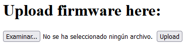
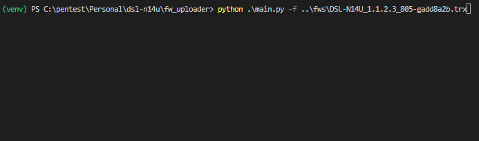

Up until now I have written about [how I failed to read my old router memory using flashrom](http://antoniovazquezblanco.github.io/2022/11/22/ASUS-DSL-N14U-flash-reading-fail.html) and how I [succeeded in dumping the flash via the bootloader](http://antoniovazquezblanco.github.io/2022/12/18/Dumping-a-router-firmware-using-the-bootloader.html), but I have yet to tell why I am doing this...

It is interesting on itself knowing how to read the memory of a device and quite useful for many reasons such as enabling secret extraction, firmware security analysis, reverse engineering... In my case, I was looking for a way to perform a full memory backup of the device in case I brick it trying to develop a custom firmware for it...

When a firmware is installed into a device, the firmware may not pack all the bits a device may need to work. For example, an update can be incremental and only pack the changes needed to update from a version to another. It is common to find firmware updates that pack both full kernels and full filesystems but that do not write the bootloader when updating. Updating bootloaders is tricky and sensible because if updates fail, the device may only be recovered if opened...

I want to learn more about embedded device development. While performing tests, I am sure I will break something. When this happens, I want to have a way to at least write a bootloader back to the device to be able to flash an original firmware or a new test. I now have a backup, let's keep it going...

I could engage in bootloader development for the DSL-N14U, but I am not going to do that... yet... The reason behind this decision is that OpenWRT project, the firmware I want in the device, has a preference towards using the original bootloader in case the users want to go back to the original firmware. I love the idea of only running (less buggy) open source software in the device but let's take it one step at a time...

Now, I have a router with an UART and an Ethernet port connected to my PC. With this setup I want to find an easy and reliable way to flash new firmwares for testing.

Using the UART I can break the boot process and access the bootloader which exposes some commands:

```plaintext
bldr> ?
                                                                              
?                                   Print out help messages.                  
help                                Print out help messages.                  
go                                  Booting the linux kernel.                 
decomp                              Decompress kernel image to ram.           
memrl <addr>                        Read a word from addr.                    
memwl <addr> <value>                Write a word to addr.                     
dump <addr> <len>                   Dump memory content.                      
jump <addr>                         Jump to addr.                             
flash <dst> <src> <len>             Write to flash from src to dst.           
flashrd <addr> <len>                Read flash from addr.                     
xmdm <addr> <len>                   Xmodem receive to addr.                   
miir <phyaddr> <reg>                Read ethernet phy reg.                    
miiw <phyaddr> <reg> <value>        Write ethernet phy reg.                   
gpioon <gpio>                       Trigger power, internet, adsl led on.     
gpiooff <gpio>                      Trigger power, internet, adsl led off.    
cpufreq <freq num> / <m> <n>        Set CPU Freq <156~450>(freq has to be multiple of 6)
ipaddr <ip addr>                    Change modem's IP.                        
httpd                               Start Web Server                          
ddrdrv <..>                         Change DDR driving length                 
```

That is all the stock bootloader can do...

There is an obvious first way I could flash kernels or firmwares. I could use the `memwl` to repeatedly send bytes and write them into ram and optionally using the `flash` command to write them into the flash memory for persistence. Although easy, to implement, it may be prone to errors because no checks of the written bytes will be performed and there may be better ways to do what we are looking for...

I found no other obvious command for my purpose. The `httpd` one was a little bit confusing but after some testing I found it exposes the following webpage...



It seems to load up a specific recovery service for firmware flashing. After testing to flash the latest version of the firmware I found that it works as expected. Let's use this!

The only thing remaining is that I will be doing tons and tons of flashing and testing. Having to manually connect to the UART, wait and interrupt the booting process, launch the web service, go to the explorer, browse the file, wait for the upload and flashing process and launch the boot sequence from the UART seems a little bit to tedious to not go mad...

For the above reasons after some scripting, I have automated the process. The code can be found at [https://github.com/antoniovazquezblanco/asus_dsl-n14u_firmware_uploader](https://github.com/antoniovazquezblanco/asus_dsl-n14u_firmware_uploader).

Interfacing with the UART is done with the `seial` python library. It is very useful for specifying the port configuration and directly having access to an input output stream.

The bootloader UART console has not really been designed to programmatically interact with it. To simplify the waiting and result parsing, the python `expect` library has been used. It allows me to send a command and specify the expected answers with a defined timeout. This avoid the usage of deficient and rigid `time.sleep` operations that either slow down the process or, if optimized, are prone to failure from time to time...

Because those two libraries are not designed to interface each other, some glue code has been developed. I believe this piece of code can be of great use for automating UART interaction, so I decided to create a pull request to the `expect` project to be included in the library. The pull request can be found at [https://github.com/pexpect/pexpect/pull/726](https://github.com/pexpect/pexpect/pull/726).

The program is simple. One single script receives a firmware file. It will interact with any found serial port and will start the web service. When found the web service it will upload the firmware, await flash confirmation and launch the firmware logging UART output for debugging.

On top of that, the program allows for IP configuration, providing a serial port and logging all UART input output to a file for record.

```plaintext
  ___  ___ _       _  _ _ _ _  _   _
 |   \/ __| |  ___| \| / | | || | | |
 | |) \__ \ |_|___| .` | |_  _| |_| |
 |___/|___/____| _|_|\_|_| |_| \___/  _   ___  ___ ___  
 | __\ \    / / | | | | _ \ |  / _ \ /_\ |   \| __| _ \ 
 | _| \ \/\/ /  | |_| |  _/ |_| (_) / _ \| |) | _||   / 
 |_|   \_/\_/    \___/|_| |____\___/_/ \_\___/|___|_|_\ 
usage: main.py [-h] [-s SERIAL] -f FIRMWARE [-l LOG] [-n NONINTERACTIVE] [-a ADDRESS]
main.py: error: the following arguments are required: -f/--firmware
```



While developing this tool, some tweaking had to be made because the bootloader does not correctly implement multipart encoding and does not follow the standard for detecting data boundaries. This has been difficult to debug and required quite some reverse engineering to discover but that is for another post.

I now have a way to programmatically upload any firmware for testing. It is not fast, but I do not have to be staring at it while it does the job...
