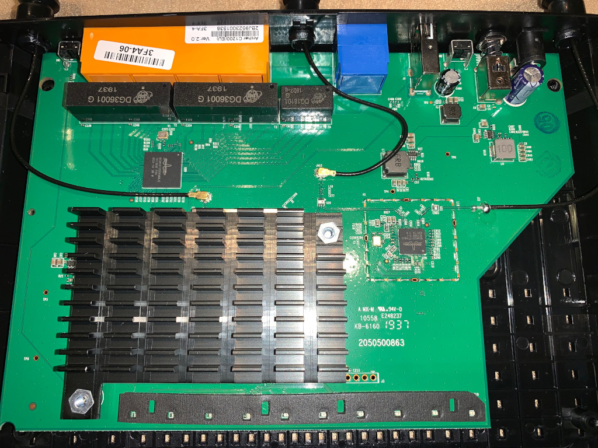
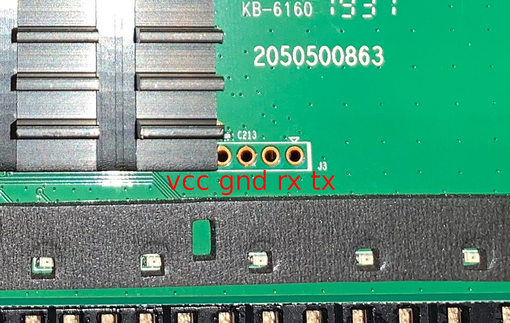

## About the serial port...

I've got my hands on a TP-Link Archer C1200 v2 router and I cannot avoid tinkering with it...

As soon as I got it I offered to bring it to a small hacking gathering we organized after work so that my colleages could play with it. It turned out that many of them never tryed to locate an UART port nor soldered before... Less than an hour later a group of happy new hardware hackers had a root shell via serial :). As it turned out, the port was extremely easy to locate and solder. The only thing we may have asked for is for TP-Link to label the port.

Here is a photo of the main router board...



Here is the detail of the serial port connections...



For those interested, you can find more info on how to locate a serial port on [this older article](/2015/05/10/UART-and-Serial-ports.html) and the info on this particular serial port location uploaded to [OpenWRT wiki](https://openwrt.org/toh/tp-link/archer_c1200_v2#serial).

## CFE

I was thinking that if I wanted to further tinker with the device I would need to back the flash of the device.

The serial port brought up a root shell after fully booting and started thinking about how could I `hexdump -x /dev/mtd*` but, if I brick it then how would I dump this back... Not good enought... I prefer bootloader stuff...

While de device was open, we took notes on the chips in the main board. This is a broadcom based device. Quick and dirty google search shows that Broadcom commonly uses a bootloader called `CFE` for their devices. It is also quite common to use `Ctrl+C` as the key to interrupt the booting process and to enter the bootloader. A couple of attempts later and voilà...

```
Decompressing...done

CFE version 9.10.178.50 (r635252) based on BBP 1.0.37 for BCM947XX (32bit,SP,)
Build Date: Thu Sep  8 14:49:19 CST 2016 (seal@seal-pc)
Copyright (C) 2000-2008 Broadcom Corporation.

Init Arena
Init Devs.
Boot partition size = 262144(0x40000)
DDR Clock: 533 MHz
Info: DDR frequency set from clkfreq=900,*533*
No GPIO defined for BBSI interface
No BBSI device
bcm_robo_enable_switch: EEE is disabled
et0: Broadcom BCM47XX 10/100/1000 Mbps Ethernet Controller 9.10.178.50 (r635252)
CPU type 0x0: 900MHz
Tot mem: 131072 KBytes

CFE mem:    0x00F00000 - 0x02FB912C (34312492)
Data:       0x00F6B754 - 0x00F70C04 (21680)
BSS:        0x00F70C10 - 0x00FB712C (288028)
Heap:       0x00FB712C - 0x02FB712C (33554432)
Stack:      0x02FB712C - 0x02FB912C (8192)
Text:       0x00F00000 - 0x00F5F4F4 (390388)

Device eth0:  hwaddr XX-XX-XX-XX-XX-XX, ipaddr 192.168.0.1, mask 255.255.255.0
        gateway not set, nameserver not set
Startup canceled
CFE> help
Available commands:

bbsi                Broadcom BBSI interface utility.
nvram               NVRAM utility.
reboot              Reboot.
md                  Dump content on memory in hex format.
fdump               Dump content on flash device in hex format.
flash               Update a flash memory device
batch               Load a batch file into memory and execute it
go                  Start a previously loaded program.
boot                Load an executable file into memory and execute it
load                Load an executable file into memory without executing it
save                Save a region of memory to a remote file via TFTP
ping                Ping a remote IP host.
arp                 Display or modify the ARP Table
ifconfig            Configure the Ethernet interface
show clocks         Show current values of the clocks.
show devices        Display information about the installed devices.
unsetenv            Delete an environment variable.
printenv            Display the environment variables
setenv              Set an environment variable.
help                Obtain help for CFE commands

For more information about a command, enter 'help command-name'
*** command status = 0
```

## Backing up the firmware...

Using the show devices command of the bootloader, it seems that there are two devices but oddly mapped into the same offsets...

```
CFE> show devices        Display ile.
Device Name          Description
-------------------  ---------------------------------------------------------
uart0                NS16550 UART at 0x18000300
flash0               ST Compatible Serial flash size 16384KB
flash0.boot          ST Compatible Serial flash offset 00000000 size 256KB
flash0.boot2         ST Compatible Serial flash offset 00040000 size 256KB
flash0.trx           ST Compatible Serial flash offset 00080000 size 1KB
flash0.os            ST Compatible Serial flash offset 0008001C size 15808KB
flash0.nvram         ST Compatible Serial flash offset 00FF0000 size 64KB
flash1.boot          ST Compatible Serial flash offset 00000000 size 256KB
flash1.boot2         ST Compatible Serial flash offset 00040000 size 256KB
flash1.trx           ST Compatible Serial flash offset 00080000 size 15808KB
flash1.nvram         ST Compatible Serial flash offset 00FF0000 size 64KB
eth0                 Broadcom BCM47XX 10/100/1000 Mbps Ethernet Controller
*** command status = 0
```

Just in case, let's try to dump all... The command I used to dump the different devices/partitions is:
```
fdump -offset=0x00000000 -size=0x01000000 flash0
```

Unfortunatelly, trying to dump flash1 throws an error:
```
CFE> fdump -offset=0x00000000 -size=0x01000000 flash1
flash1: Device not found
*** command status = -6
```

Anyways, after launching the dump command go and have some sleep... It will take a while to dump 16MB in a 115200 baud connection...

After the nap, you can convert the text dumps into binary files by running the following command:
```
grep -E "^[0-9a-f]+  " flash0.txt | cut -d' ' -f3-18 | xxd -r -p > flash0.bin
```

It may be interesting to have the different sections split into different files in case I just need to flash back a single block to avoid waiting so much...

To flash a block back to the device we may use the flash command avaiable in CFE:

```
flash -noheader 192.168.0.100:flash0.trx.bin flash0.trx
```
